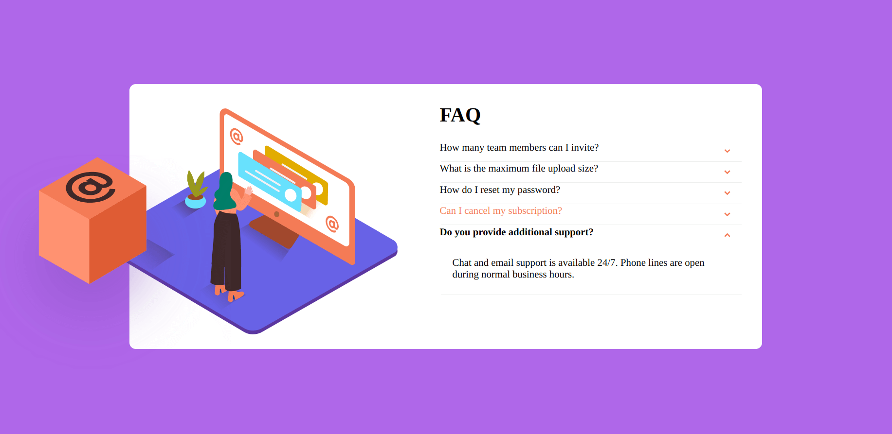
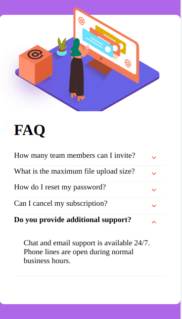

# Frontend Mentor - FAQ accordion card solution

This is a solution to the [FAQ accordion card challenge on Frontend Mentor](https://www.frontendmentor.io/challenges/faq-accordion-card-XlyjD0Oam). Frontend Mentor challenges help you improve your coding skills by building realistic projects.

## Table of contents

- [Overview](#overview)
  - [The challenge](#the-challenge)
  - [Screenshot](#screenshot)
  - [Links](#links)
- [My process](#my-process)
  - [Built with](#built-with)
  - [What I learned](#what-i-learned)
  - [Continued development](#continued-development)
  - [Useful resources](#useful-resources)

## Overview

### The challenge

Users should be able to:

- View the optimal layout for the component depending on their device's screen size
- See hover states for all interactive elements on the page
- Hide/Show the answer to a question when the question is clicked

### Screenshot

### Links

- Live Site URL: [Github Pages](https://jdegand.github.io/faq-accordion-card/)

## My process

### Built with

- No JavaScript
- Desktop first
- CSS custom properties
- Flexbox

### What I learned

The content needs to be in the same div as the radio button to be able to be targeted with :checked.  
The content needs to a sibling or descendant.  

### Continued development

- Semantic HTML.
- Web Accessibility.
- Have to check various screen sizes since absolute positioning was used.
- Only allowed one question open at a time.

### Useful resources

- [W3 Docs](https://www.w3docs.com/snippets/css/how-to-style-the-selected-label-of-a-radio-button.html) - Checked CSS
- [Auto Prefixer](https://autoprefixer.github.io/) - Online autoprefixer
- [Web Platform](https://webplatform.news/issues/2020-08-26) - Replaced content and CSS
